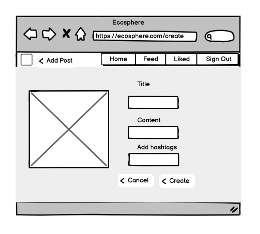
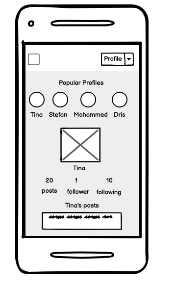
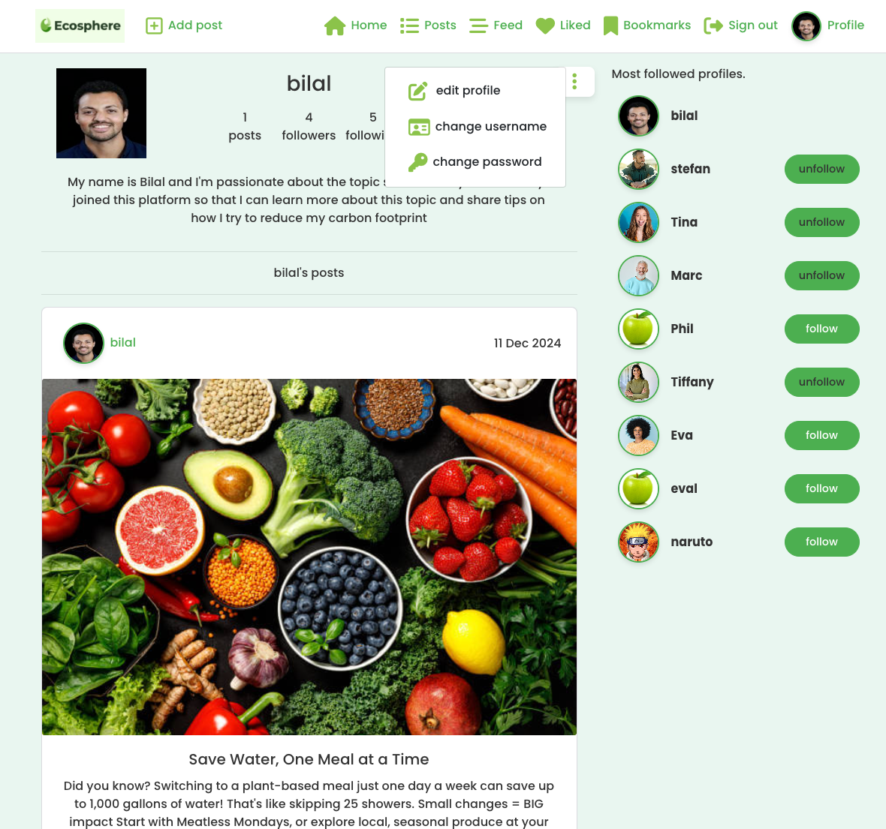
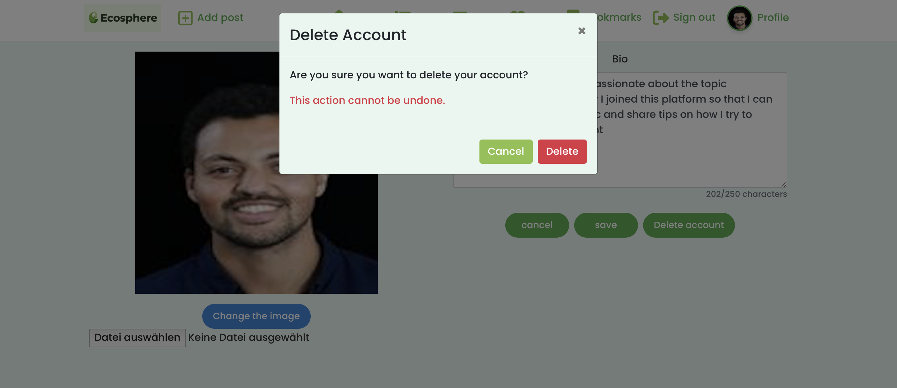
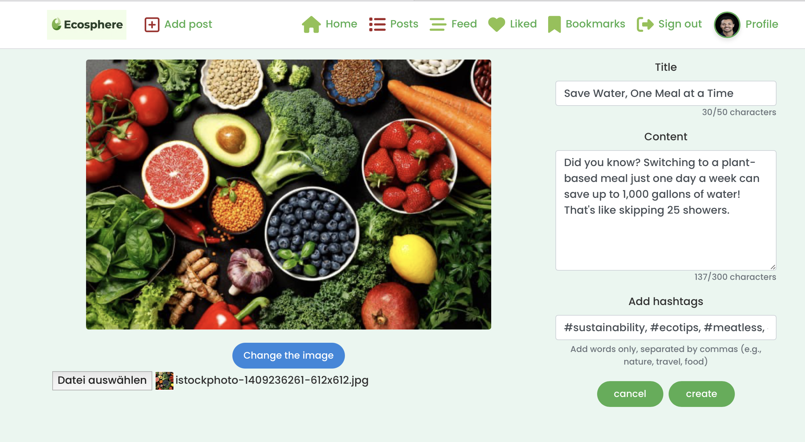
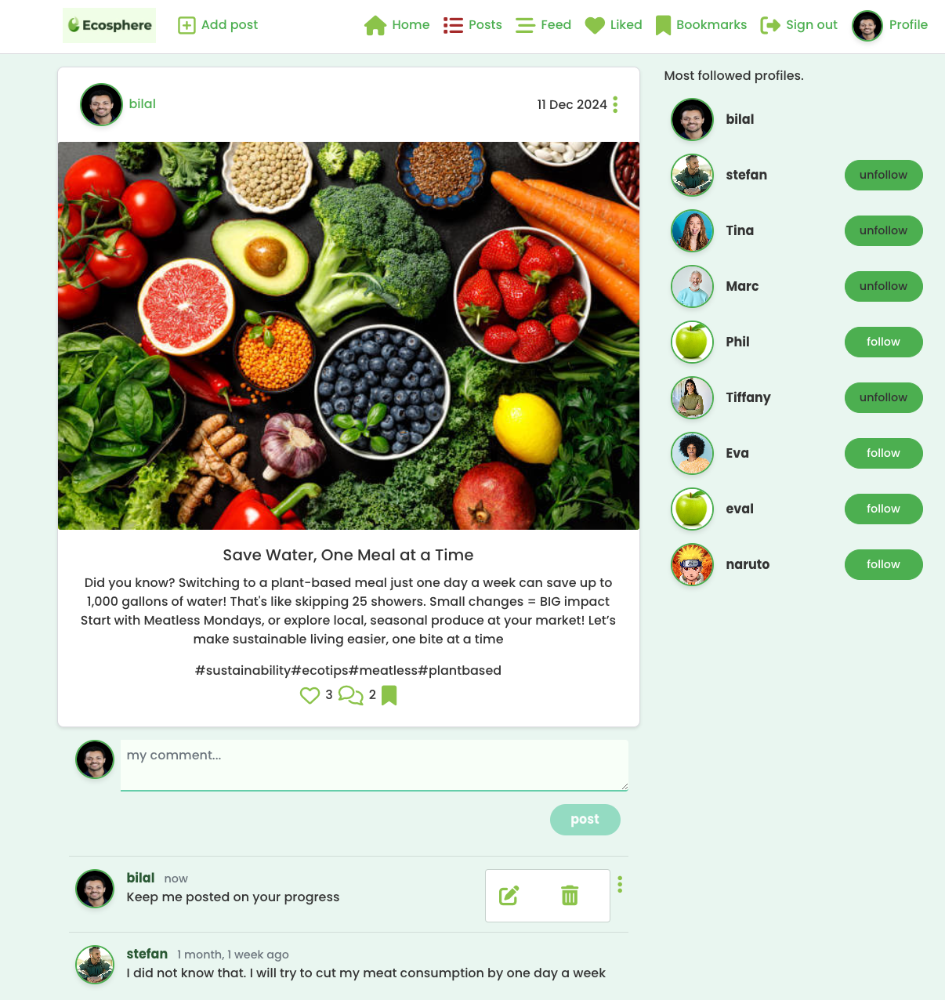
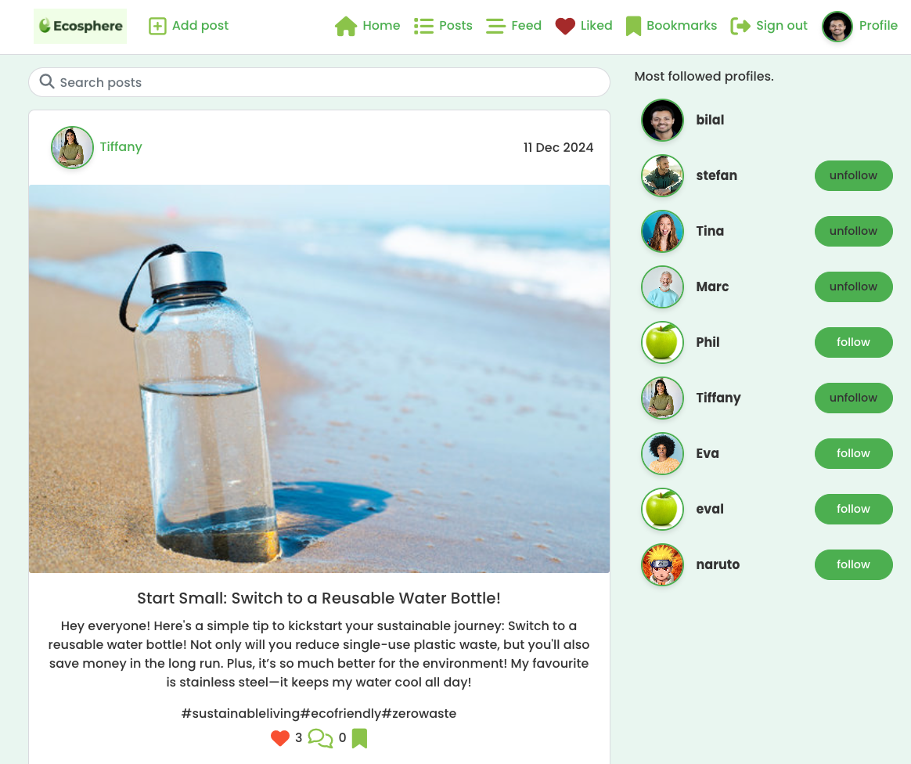
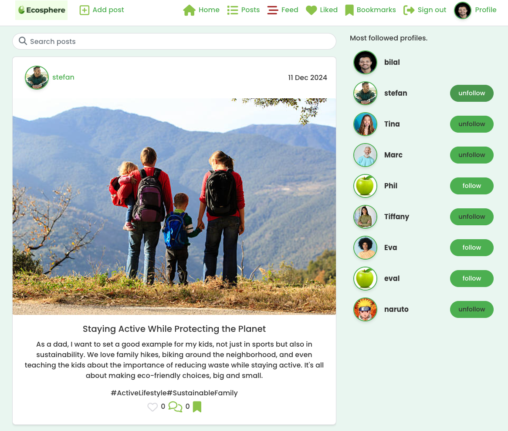
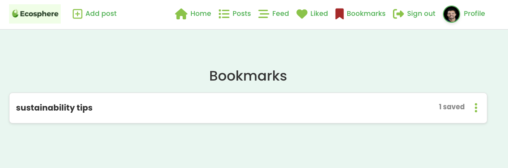

# Welcome to Ecosphere

[View the live project here](https://ecosphere-social-8d56a42d0db7.herokuapp.com/)

Ecosphere is a social media platform designed to connect users who are passionate about sustainability and eco-friendly living. The platform allows users to share posts, follow other users, like and comment on posts, and engage in a community focused on environmental awareness. This project was developed as part of the Code Institute's fourth Project Portfolio.

# Table of Contents
1. [UX](#ux)
2. [Agile Development](#agile-development)
3. [Features Implemented](#features-implemented)
4. [Technology Used](#technology-used)
5. [Testing](#testing)
6. [Bugs](#bugs)
7. [Deployment](#deployment)
8. [Credits and Acknowledgements](#credits-and-acknowledgement)

# UX

## Goals and Target Audience
Ecosphere is designed for individuals who are passionate about sustainability and eco-friendly living. The website provides essential features for easy navigation, user engagement, and community building, suitable for individuals, families, and groups looking to connect and share their experiences and knowledge about environmental awareness.

## Design 
The Ecosphere website embraces a color palette inspired by nature, with earthy and inviting tones that reflect the theme of sustainability:

Green and Earthy Tones: Rich shades of green and earthy tones are used as primary colors, evoking the natural warmth and sophistication associated with environmental awareness.
Accents of Blue and White: These accents are used sparingly to highlight call-to-action buttons, enhancing user navigation while fitting the theme of sustainability and clarity.
Light and Airy Backgrounds: These tones provide a clean and welcoming background that contrasts beautifully with the deeper colors, ensuring readability and a visually pleasing experience.

This color scheme not only aligns with the theme of sustainability but also helps create an inviting, elegant atmosphere for users exploring the platform’s offerings and engaging with the community.

## Database planning

## Final data structure

After refining the project and finalizing essential features, I created the database schema to accommodate specific requirements for user management, post creation, and community engagement. Using Creately, I visually outlined the final data structure, focusing on the User, Post, Comment, Like, and Profile tables, and their relationships.

## Wireframes

### Large and medium screens





### Small screens





# Agile Development
## Overview
This project followed Agile methodology with iterative development cycles, feature prioritization, and task tracking. Development tasks were organized and tracked with GitHub Projects, which ensured the timely delivery of essential functionalities. Each sprint was dedicated to the development and refinement of specific feature sets, including the homepage design, post creation, user profiles, and community engagement.

I initiated this project with a clear intent to streamline workflow and effectively manage the expected workload. After outlining the major epics, I systematically decomposed them into actionable user stories and smaller tasks. This approach not only enhanced my ability to monitor progress but also served as a motivational framework to complete the project on schedule. In addition to the user stories, I created distinct issues for each module of the README.md file, further clarifying objectives and ensuring all components were addressed.

For a comprehensive overview of the project's progress and workflow, please refer to this Kanban page

## User Stories
To kickstart the project, I adopted a user-centric approach. By envisioning myself as a potential user, I identified key features and functionalities that would enhance the website's usability and appeal. I then translated these insights into a set of user stories, prioritizing core features that would provide a solid foundation for the website.

Each user story was broken down into smaller, actionable tasks, allowing for a structured and efficient development process. As I progressed through the development phase, I tracked my progress and documented any challenges or solutions encountered. This approach ensured a transparent and organized development workflow.

By prioritizing user needs and following an agile methodology, I aimed to deliver a high-quality website that meets the expectations of both users and stakeholders.

### List of User Stories
1. [User Story: Home Page](https://github.com/BilalEssafi1/ecosphere/issues/12)
2. [User Story: Sign-Up for Account](https://github.com/BilalEssafi1/ecosphere/issues/13)
4. [User Story: Sign-In to Account](https://github.com/BilalEssafi1/ecosphere/issues/14)
5. [User Story: Create Post](https://github.com/BilalEssafi1/ecosphere/issues/15)
6. [User Story: Follow Users](https://github.com/BilalEssafi1/ecosphere/issues/16)
7. [User Story: Like, Comment and Bookmark Posts](https://github.com/BilalEssafi1/ecosphere/issues/17)
8. [User Story: Edit Profile](https://github.com/BilalEssafi1/ecosphere/issues/18)

# Technology Used
- Frontend: HTML, CSS, JavaScript, Bootstrap
- Backend: Django, Python
- Database: PostgreSQL (configured for production via DATABASE_URL)
- Deployment: Deployed on Heroku, with dj_database_url for database handling.
- Other: Cloudinary API, Font Awesome for icons, and Crispy Forms for Django form styling.


## Homepage
- Navbar: User-friendly navigation bar is present on all pages and it adapts to the user's authentication status (logged in or not.) Logged-in users have access to Post, like, comment, follow, bookmark and profile features. 
- Home Page: Displays recent posts, popular profiles, number of likes and comments as well as a searchbar. 


## User Registration and Profile
- Account Creation: Users can register to like posts, comment on posts, add own posts or follow members they like.

- Profile Management: Users can update profile details and change passwords.

- Account Deletion: Option to delete account with confirmation prompts.


## Add and Edit Post
- Add Post: Allows users to add a post including titile, content, image, and hashtags for better findability.

- Edit Post: Allows users to edit and delete a post.


## Comment and Edit Comment
- Comment on a Post: Allows users to add a comment to a post.

- Edit Comment: Allows users to edit and delete comments. 


## Like and unlike a post
- Like and unlike a post: Allows me to like a or unlike a post when clicking on the heart icon.

- Liked Post Feed: Liked Posts are saved in th liked post feed for better findability.


## Follow Users
- Follow and unfollow users: Allows me to follow users I like and also unfollow them.

- Followed Users Feed: Posts from followed users are saved in the followed user feed for better findability.


## Bookmarks
- Bookmark Posts: Allows users to bookmark posts into a self created folder structure for better findability.

- Bookmarked Folders Feed: Allows users to access posts saved in self created folderrs


## Responsive Design
The website is mobile-friendly and responsive across all devices, optimized with Bootstrap for consistent styling.


## Future Feature ideas
- Add challenges and badges to allow users to suggest and participate in sustainability challenges and earn badges for participating or winning the challenge
- Implement advanced token refresh functionality to resolve the need for clearing cache and cookies to log in after signing out, ensuring seamless handling of expired tokens and CSRF synchronization.
- Add a more custom 404 pages
- Add self-service forgot password feature via email verification
- Improve performance on the side by implementing stricter image sizing rules
- Add bookmark editing functionalities to rename a bookmark or also delete it
- Add video upload functionality to allow users to upload different types of assets

# Features Implemented

# Testing

## Validator Testing

- HTML
    - No errors were returned when passing through the official W3C validator.


- CSS
    - No errors were returned when passing through the official Jigsaw validator.


- JavaScript
    - No significant issues were returned when passing the code through Jshint.


- PEP8 Validation: The python code of the my developed Django Rest Framework API which you can find [here](https://github.com/BilalEssafi1/drf-api) was validated using PEP8 style guide without any errors.


- Accessibility
    - I confirmed that the colors and fonts chosen are easy to read and accessible by running it through lighthouse in devtools.


## Manual testing

| Test Case | Action | Expectation | Pass/Fail |
| --- | --- | --- | --- |
| Navigation | Tested by clicking nav links and checking that the user ends up on the correct landing page. | User is redirected to the correct landing page. | Pass | 
| User Registration | This was tested by creating a new user account and confirming that the user was redirected to the sign-in landing page. | The user is automatically redirected to the sign-in interface after successful registration to log in with created user details. | Pass | 
| User Login | This was tested by logging in with a valid user account and verifying that the user is being redirected to the logged-in interface. | The user is automatically redirected to the logged-in interface after successful login. | Pass | 
| Admin Panel | This was tested by logging in as an admin and performing CRUD operations on content and users. | The admin is redirected to the admin dashboard after successful login and can view, create, delete users and manage their permissions. | Pass | 
| Add a Post | This was tested by logging in with a valid user account and clicking on "Add post" to create a new post. | A post form opens when the user clicks on the "Add post" button when logged in that allows them to select a picture for their post, add a title, content, and suitable hashtags to increase findability. | Pass | 
| Edit a Post | This was tested by logging in with a valid user account and clicking on the user’s owned posts, then clicking on the right-hand corner on the three dots that open the edit selector and editing the post form that opens up. | A post form opens when the user clicks on the edit button, which they can only see on their own posts when logged in, and allows them to edit the picture, title, content, and hashtags. | Pass | 
| Delete a Post | This was tested by logging in with a valid user account and clicking on the user’s owned posts, then clicking on the right-hand corner on the three dots that open the edit selector and selecting the trash icon. | The user is redirected to the Add post page when clicking on the trash icon to create a new post, while the old post has been deleted. | Pass | 
| Follow a User | This was tested by logging in with a valid user account and clicking on follow users in the Most popular profiles section. | The follow button changes from 'Follow' to 'Unfollow,' and the "following" statistic on the user's profile updates accordingly. | Pass | 
| Unfollow a User | This was tested by logging in with a valid user account and clicking on unfollow users in the Most popular profiles section. | The follow button changes from 'Unfollow' to 'Follow,' and the "following" statistic on the user's profile updates accordingly. | Pass |
| Like a Post | This was tested by logging in with a valid user account and clicking on the like heart icon. | The heart button turns red, and the count increases next to it. | Pass |
| Unlike a Post | This was tested by logging in with a valid user account and clicking on the liked heart icon. | The heart button changes back to white, and the count decreases next to it. | Pass |
| Follower Feed | This was tested by clicking on Feed in the navigation bar and checking that the user ends up on the right landing page. | The user is redirected to the correct landing page where they now only see posts from people they follow. | Pass | 
| Liked Post Feed | This was tested by clicking on Feed in the navigation bar and checking that the user ends up on the right landing page. | The user is redirected to the correct landing page where they now only see posts they liked. | Pass |
| Create a Bookmark | This was tested by clicking on the bookmark icon below and validating that the user is being redirected to a folder creation form that allows them to create a new folder or store the post under an existing one. | The user is redirected to a folder creation form after clicking on the bookmark icon below the post, where they can create a new bookmark or store the post under an existing folder when clicking on the existing folder. | Pass |
| Bookmark Feed | This was tested by clicking on the bookmark icon in the navigation bar and checking that the user ends up on the right bookmark folders landing page. | The user is redirected to a landing page where they can find all created folders as well as the number of posts they have saved under them. Once they click on the folder, it shows them all the bookmarked posts. | Pass |
| Manage User Profile | This was tested by logging in with a valid user account and clicking on the Profile icon in the navigation bar and checking that the user ends up on the user profile where they can edit or delete their account, change the username, and the password. | The user is able to edit the profile, like uploading a new image, changing the bio, deleting the account, changing the username, and the password. | Pass | 
| Filter Posts with Searchbar | This was tested by logging in with a valid user account and typing in a keyword into the searchbar that is featured on the homepage, which then filters through the posts to find matches. | The user is able to add keywords to filter through the posts and only get results that contain the relevant keyword. | Pass | 
| Logout | This was tested by clicking on the "Sign Out" button to log out from the website. | The user is redirected to the sign-in page after clicking on "Sign Out." | Pass | 


# Bugs

## Solved Bugs
- The image upload functionality was storing files locally instead of uploading them to Cloudinary because of incomplete storage configuration. Images were being saved with local URLs (e.g., "http://8000-bilalessafi1-drfapi-3ety8hg1ccw.ws.codeinstitute-ide.net/media/posts/") rather than being uploaded to Cloudinary's cloud storage. To resolve this, I added explicit MediaCloudinaryStorage to the Post model's image field and verified proper initialization of Cloudinary settings. The solution ensures images are now properly uploaded to Cloudinary and served via their CDN URLs.

- The dropdown menu and profile image were being hidden behind other elements on the page due to positioning and z-index and overflow issues. The dropdown and image components were not being properly layered above other content, causing them to be clipped or not displayed. To resolve this, I applied the following fixes:
I ensured the parent container of the dropdown and profile image had position: relative; to establish a positioning context.
I adjusted the z-index values of the dropdown and profile image to ensure they appear above other elements, particularly the background and parent containers.
I set overflow: visible; on the parent containers to prevent clipping of child elements.
These changes ensure that dropdown menus, profile images, and other modals are correctly displayed above the background and other elements, improving visibility and user interaction.

- The default avatar image for new users was not showing correctly, and instead, an incorrect image URL was being generated. This occurred because the MEDIA_URL and MEDIA_ROOT settings, which are used for local file storage, were conflicting with Cloudinary’s storage system.
To fix this:
I removed the MEDIA_URL and MEDIA_ROOT settings from settings.py to avoid any conflict with Cloudinary.
I ensured that the DEFAULT_FILE_STORAGE setting was configured to use cloudinary_storage.storage.MediaCloudinaryStorage, which properly handles Cloudinary image URLs.
This resolved the issue, and now new users see the correct default avatar image from Cloudinary.

- The login functionality failed due to CSRF token and authentication issues across different browsers. The solution involved updating several components: adding proper token refresh logic in useRedirect.js, implementing CSRF handling in SignInForm, and updating axiosDefaults.js with improved request interceptors. We also added proper error logging and token storage management. Browser caching caused persistent issues in previously used browsers, which were resolved by clearing cached data, cookies, and local storage. The solution ensures consistent authentication behavior across all browsers and sessions.
The PostsPage component failed to display posts after login due to redundant token validation causing authentication errors. The issue stemmed from explicit token checking in the component while the axiosReq instance was already handling authentication through interceptors. The solution involved simplifying the PostsPage component by removing manual token validation and relying on the existing axios interceptors for authentication. We also added the currentUser to the dependency array to ensure the component responds to authentication state changes. These changes allowed the component to properly utilize the authentication system already in place, resolving the "No valid authentication token" error and successfully displaying posts after login.

## Known Bugs

-  Users may need to clear cache and cookies to log in again and use the website properly after signing out
- When trying to edit hashtags on a post, users currently need to remove the hashtag before submitting. This is because the current system doesn't allow concatenated hashtags and sentences to be submitted together

# Deployment

The project consists of two parts that were deployed separately:

1. A React frontend application deployed to Heroku
2. A Django REST Framework API also deployed to Heroku

## Frontend Deployment 

The React frontend was deployed following these steps:

1. Create the Heroku App:
- Log into [Heroku](https://www.heroku.com/)
- Click "New" to create a new app
- Give the app a name and select a region
- Click "Create App"

2. Connect to GitHub:
- In the Deploy tab, select "GitHub" as the deployment method
- Connect to GitHub if prompted
- Search for and select your repository
- Click "Connect"

3. Set up environment variables:
- In the Settings tab, click "Reveal Config Vars"
- Add necessary environment variables:
```
REACT_APP_API_URL=https://your-drf-api-url.herokuapp.com
```
4. Deploy:
- In the Deploy tab, select "Enable Automatic Deploys" for automatic deployment when you push to main
- Click "Deploy Branch" to deploy manually
- Once complete, click "View" to launch your app

## DRF API Deployment

The [Django REST Framework API](https://github.com/BilalEssafi1/drf-api) was deployed separately following these steps:

1. Create a seperate Heroku App:
- Log into [Heroku](https://www.heroku.com/)
- Click "New" to create a new app
- Give the app a name and select a region
- Click "Create App"

2. Set Up Environment Variables
- Create Environment Variables in Your Django Project:
    - In your Django project directory, create a file named env.py at the root level.
    - Inside env.py, import the os module. Set up necessary environment variables as follows:
    ```
    import os
    os.environ['SECRET_KEY'] = 'your-unique-secret-key'
    os.environ['DATABASE_URL'] = 'your-database-url'
    ```

- Update settings.py:
    - Open your settings.py file and modify it to use the environment variables:
        - Replace the existing SECRET_KEY line with:
        ```
        SECRET_KEY = os.environ.get('SECRET_KEY')
        ```
        - For the database configuration, use dj_database_url to parse the DATABASE_URL:
        ```
        import dj_database_url
        DATABASES = {
        'default': dj_database_url.parse(os.environ.get('DATABASE_URL'))
        }
        ```
3. Add Required Imports:
- At the top of your settings.py, add the necessary imports:
```
from pathlib import Path
import os
import dj_database_url
if os.path.isfile('env.py'):
    import env
```
4. Set Environment Variables in Heroku:
- In your Heroku app dashboard, go to the “Settings” tab and click on “Reveal Config Vars”.
- Add the DATABASE_URL and SECRET_KEY keys with their respective values.
3. Configure Static Files and Templates
- Static Files Settings:
    - In settings.py, configure your static files settings as follows:
    ```
    STATIC_URL = '/static/'
    STATICFILES_DIRS = [os.path.join(BASE_DIR, 'static')]
    STATIC_ROOT = os.path.join(BASE_DIR, 'staticfiles')
    ```
-  Templates Directory:
    - Set up the templates directory:
    ```
    TEMPLATES_DIR = os.path.join(BASE_DIR, 'templates')
    ```
    - Modify the TEMPLATES setting to include the new directory:
    ```
    TEMPLATES = [
        {
            'BACKEND': 'django.template.backends.django.DjangoTemplates',
            'DIRS': [TEMPLATES_DIR],
            ...
        },
    ]
    ```
- Allowed Hosts:
    - In settings.py, update the ALLOWED_HOSTS list to include your Heroku app URL:
        ```
        ALLOWED_HOSTS = ['your-app-name.herokuapp.com']
         ````

- Create Required Directories:
    - In your project structure, create two new folders at the top level: static and templates, to hold your static files and HTML templates, respectively.

4. Create a Procfile
- Setting Up the Procfile:
    - In the root directory of your Django project, create a file named Procfile (with a capital "P").
    - Inside the Procfile, add the following line to specify how to run your application:
    ```
    web: gunicorn your_project_name.wsgi
    ```

5. Migrate Database Models
- Open your terminal and run the migrations to apply your models to the new PostgreSQL database:
```
python manage.py migrate
```
6. Push Changes to GitHub
- Stage, commit, and push your changes to the GitHub repository:
```
git add .
git commit -m "Configured deployment settings for Heroku"
git push origin main
```

7. Deploy the Application
- Deploy on Heroku:
    - Go back to the Heroku dashboard, navigate to the "Deploy" tab, and manually trigger a deployment of your branch.
    - Monitor the build log for any errors during the build process.
- Check Deployment Status:
    - If the deployment is successful, Heroku will display a message indicating that your app has been deployed, along with a link to your live application.

- Troubleshooting:
    - If your initial builds fail (common issues might include incorrect static file configuration or misnamed directories), review the error messages, make the necessary code adjustments, and redeploy.

## Forking and Cloning the Repository

### How to Fork this Project:

1. Login to [GitHub](https://github.com/)
2. Navigate to the frontend repository: https://github.com/BilalEssafi1/ecosphere
3.  Click on the Fork button in the top-right corner
4. Select Create a new fork

For the API:

Follow the same steps but navigate to: https://github.com/BilalEssafi1/drf-api

### How to Clone this Project

1. Login to [GitHub](https://github.com/)
2. Navigate to the frontend repository: https://github.com/BilalEssafi1/ecosphere
3. Click the green Code button
4. Under the Clone section, choose your preferred method (HTTPS, SSH, or GitHub CLI)
5. Open the terminal in your code editor
- Use the cd command to navigate to the directory where you want to clone the repository
6. Run the git clone command followed by the repository URL you copied, and press Enter

For the API:

Follow the same steps but use the API repository URL: https://github.com/BilalEssafi1/drf-api


# Credits and Acknowledgement

This project benefited from the code institute's training material, documentations, and creative assets, and tutorials found online, helping shape Ecospher's functionality and visual appeal:
- Code and Structure Inspiration:
    - [Code Institute's Django Restframework Project](https://github.com/Code-Institute-Solutions/drf-api/tree/6095fae29d4a24d87f9a2ff6dfe4a36f122f5d67): Provided a foundational structure for creating the API that was used throughout the Project.
    - - [Code Institute's Moments Project](https://github.com/mr-fibonacci/moments/tree/1b62c43fc5c4cafa1dd038d450316db139f463d1): Provided a inpiration for the social media idea and a foundational structure for the Project. 

- Images and Visual Assets:
    - [Leonardo AI](https://leonardo.ai/): Used to create the Ecosphere logo.
    - [Istock](https://www.istockphoto.com/de): Used to get assets for posts and fictional user accounts.

- [React Official Documentation](https://legacy.reactjs.org/docs/getting-started.html): 
  This documentation was instrumental in implementing React hooks (useState, useEffect) throughout the components, Context API implementation for state management, and the creation of custom hooks like useRedirect and useClickOutsideToggle.

- [React Bootstrap Official Documentation](https://react-bootstrap.netlify.app/):
  The project's UI components extensively utilize React Bootstrap for forms, modals, and layout components. Their documentation provided essential patterns for responsive layouts and component styling, which were implemented in the navigation system, authentication forms, and post displays.

- [Django REST Framework Official Documentation](https://www.django-rest-framework.org/):
  The backend API structure follows DRF best practices for serializers, permissions, and viewsets. This documentation was crucial in implementing features like the bookmark system and ensuring proper API response formatting. Their guidelines helped create a robust and scalable API structure.